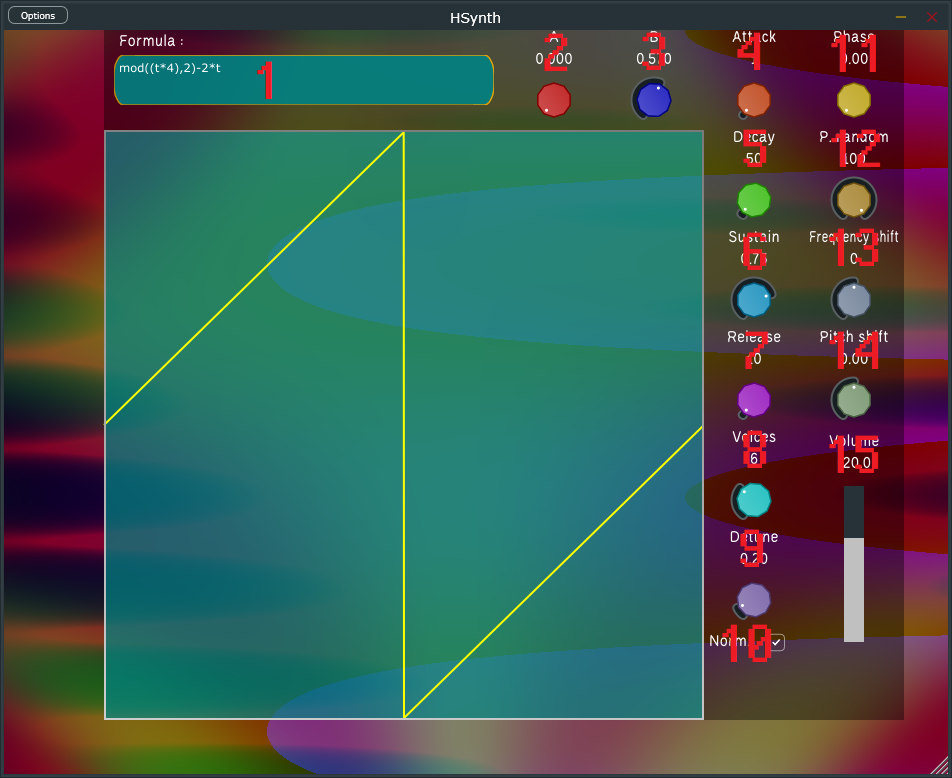

# HSynth
A synthesizer that can parse a mathematical expression to turn it into a wavetable. Unlike other wavetable synthesizers, you get two modulation parameters to get an additional dimension to vary and play around sound. Using the GPU, it computes 500 MB of audio data in less than a second.

However it is difficult to create formulas for and is not intended for people unfamiliar with trigonometry and calculus. If you are willing to learn and to experiment with these abstract concepts, you can quickly generate sounds that would be difficult to make through other plugins.
Let's first look at the main interface.

## General overview

You can double-click any knob to reset its value.
1) The formula text box. More about it in the next section.
2) The A param that can be used in the formula.
3) The B param that can be used in the formula.
4) The attack parameter of the ADSR envelope in milliseconds. Will cause clicks if set to 0.
5) The decay parameter of the ADSR envelope in milliseconds. Will cause clicks if set to 0.
6) The sustain parameter of the ADSR envelope between 0 and 1.
7) The release parameter of the ADSR envelope in milliseconds.
8) The number of chorus voices played on each note (1 voice means no chorus).
9) Detune in semitones. Does nothing without multiple voices. Will cause the voices to play further out of tune when increased.
10) The normalize option. Causes the wavetable values to get both limited (cut above +1 and below -1) and normalized (scaled uniformly to reach at extrema +1 or -1). Basically prevents the synth from getting excessively loud or quiet when modulating.
11) The phase value each voice starts at. It's between 0 and 1 and will most likely change nothing audibly. Would be useful to synchronize multiple instances though.
12) Phase randomness, will add a random value to the starting phase of each voice, causing them to all constructively interfere when at 0.
13) Frequency shifting in hertz, moves every voice together.
14) Pitch shifting in semitones, moves every voice together.
15) Volume in decibels.

Note that the graph changes when you move the A and B knobs only if you used them in the formula and that it may draw outside of its box if you uncheck the Normalize option. You can click the parameter values to then set them to an exact value.
Also there is no antialiasing so you can frequency shift your voices into negative values or way beyond the maximum your sample rate permits.

## How to write a formula
Here are the useful variables :
- `t` The main variable going from 0 on the left of the graph to 1 on the right.
- `p` Is equal to `t*pi*2`, useful for trig functions.
- `P` Is equal to `pi`.
- `T` Is `tau = 2*pi`.
- `a` Is the value of the A parameter.
- `b` Is the value of the B parameter.
- `e` Is euler's constant.
Here are the operations that you can use :
- ADD a+b
- SUB a-b
- MUL a\*b
- DIV a/b
- MOD a%b
- POW a\*\*b
- LESS a\<b
- GREATER a>b
- EQUAL a=b
- LESS_OR_EQUAL a<=b
- GREATER_OR_EQUAL a>=b

The functions you can add :
- The cardinal sine sinc(p)
- Sine sin(p)
- Cosine cos(p)
- Tangent tan(t)
- Arcsine asin(t)
- Arccosine acos(t)
- Arctangent arctan(t)
- Natural logarithm log(t)
- Exponential exp(t)
- Square root sqrt(t)
- Hyperbolic cosine cosh(t)
- Hyperbolic sine sinh(t)
- Hyperbolic tangent tanh(t)
- Absolute value abs(t)
- Sign function sign(t)
- Error function erf(t)
- Maximum max(t, a)
- Minimum min(t, a)
- Power pow(t, a)
- Round round(a)
- Floor floor(a)
- Ceiling ceil(a)
- Modulus mod(t, a)
- Gamma function gamma(t)

If you mistype your formula, an error message will appear below the text box. Any infinite or undefined value like 1/0 or sqrt(-1) gets replaced with zero.